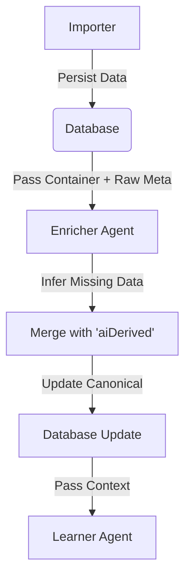

# Enrchment Agent (The "Analyst")

## Overview
The **Enricher Agent** is a post-persistence, non-destructive layer designed to infer missing operational data from raw inputs without overwriting "Official" canonical data. 

**Core Philosophy: Zero Overwrite**.
The Enricher **NEVER** modifies the root columns of the `Container` table (e.g., `container.serviceType`, `container.currentStatus`). Instead, it writes all its findings to a dedicated JSON column: `container.aiDerived`.

---

## Architecture

The Enricher runs immediately **after** the Importer (Step 4) and **before** the Learner (Step 5).



### Why Post-Persistence?
1.  **Safety**: Since the Importer has already saved the data, a crash in the Enricher cannot cause data loss.
2.  **Performance**: We can run deterministic checks in <1ms per row.
3.  **Context**: The Enricher has access to the full "Canonical" record (e.g., it can compare `atd` vs `ata`) to make smarter decisions than the pure mapper.
4.  **Integration**: During the persistence phase, enriched data (Service Type, Status) is **explicitly merged** into the canonical record if the canonical field is empty, ensuring no data loss. Inferred statuses (e.g., `IN_TRANSIT`) are mapped to valid database stages (`DEP`, `ARR`).

---

## Data Model: `aiDerived`

The `aiDerived` column is a `JSONB` object with the following structure:

```json
{
  "lastRun": "2026-01-19T00:00:00Z",
  "mode": "IMPORT_FAST", 
  "statusInference": "IN_TRANSIT", // Top-level convenience
  "fields": {
    "serviceType": {
      "value": "FCL",
      "confidence": "HIGH",
      "source": "raw.Ship_Type",
      "method": "Regex_ServiceType",
      "rationale": "Matched FCL/Size pattern in 'Ship_Type'"
    },
    "finalDestination": {
      "value": "Chicago",
      "confidence": "MED",
      "source": "raw.Ship_to_City",
      "method": "Text_Cleanup",
      "rationale": "Standardized capitalization"
    }
  }
}
```

---

## Logic & Rules Catalog

The Enricher uses **Deterministic Heuristics** (Safe, Fast) during import.

### 1. Service Type Inference
*   **Goal**: Detect `FCL` vs `LCL`.
*   **Gating**: Only runs if `canonical.serviceType` is null.
*   **Input**: 
    1. Checks `canonical.currentStatus` for "FCL"/"LCL" patterns (fixing common mapping errors).
    2. Checks raw keys matching `Shipping Type`, `Service`, `Load Type`, `Status`, etc.
*   **Logic**: 
    *   `LCL`, `LESS` -> **LCL**
    *   `FCL`, `FULL`, `CY/CY`, `20`, `40` -> **FCL**
*   **Method ID**: `Regex_ServiceType`

### 2. Status inference ("Truth Engine Lite")
*   **Goal**: Determine status when the explicit `currentStatus` field is empty or generic.
*   **Gating**: Built-in. Only overrides if the new status is "stronger" or if `currentStatus` is null.
*   **Priority Logic**:
    1.  **Manual Override**: (Locked) User selected status always wins.
    2.  **Date-Based (Enricher)**: Physical event dates imply status.
    3.  **Carrier (Raw)**: Carrier's explicitly stated status.
    4.  **AI Inference**: Weakest signal.
*   **Enrichment Rules** (Date-Based):
    *   IF `deliveryDate` exists -> **DEL** (Delivered)
    *   IF `gateOutDate` exists -> **CGO** (Cargo Gate Out)
    *   IF `emptyReturnDate` exists -> **RET** (Empty Returned)
    *   IF `ata` exists -> **ARR** (Arrived at Port)
    *   IF `atd` exists -> **DEP** (Departed / In Transit)
    *   IF `etd` exists -> **BOOK** (Booked)
*   **Method ID**: `Date_Inference`

### 3. Destination Cleaning
*   **Goal**: Fix all-caps or messy city names.
*   **Input**: Keys matching `Ship to City`, `Delv Place`, `Final Dest`.
*   **Logic**: Title Case transformation (e.g., "CHICAGO" -> "Chicago").
*   **Method ID**: `Text_Cleanup`

### 4. Status Priority & Locking
To prevent the AI from overwriting human decisions or valid data streams, the system enforces a strict priority:
1.  **Manual Override**: When a user selects a status in the UI, it is saved to the database and the field is added to `metadata.lockedFields`. Future imports will **ignore** updates to this field.
2.  **Date-Based Inference**: If no lock exists, the Enricher checks for hard dates (Delivery, Gate Out). These are considered "physical truths" and override ambiguous codes.
3.  **Carrier Status**: If no dates are found, we use the normalized Carrier Status (e.g., "On the Water" -> "DEP").
4.  **AI Fallback**: If all else fails, the AI attempts to infer status from context.

---

## Troubleshooting & Verification

### "The Status is Wrong!"
Check the `aiDerived` column.
*   **Scenario**: User says "Container is In Transit, but system says Booked".
*   **Fix**: 
    1.  Inspect `aiDerived.statusInference`. 
    2.  If it says `IN_TRANSIT`, then the UI might just be prioritizing the canonical `currentStatus` (which is safe).
    3.  If it is null, check if `atd` is actually populated in the database.

### "Enrichment didn't run"
*   Check `aiDerived` is null.
*   Verify the **Enrichment Toggle** was ON during import.
*   Verify `rawMetadata` exists on the container (Enricher needs raw data to work).

### Manual Test Script
You can debug logic in isolation without running a full import:

```bash
npx tsx scripts/test_enricher.ts
```

This script mocks a container and runs the rules, outputting the implementation of `FCL` detection and `IN_TRANSIT` logic.

## Container Level Execution (On-Demand)

The Enricher can be triggered manually for a single container directly from the **Container Details Page**. This is useful for:
1.  **Refining Data**: Processing containers imported before enrichment was enabled.
2.  **Debugging**: Testing how the agent interprets specific container metadata.
3.  **Real-time Updates**: Re-calculating inferences after data corrections.

### How it Works

1.  **UI Trigger**: A "Run Enricher" button is available in the header of the Container Details page (replacing the previous "Re-run Auditor" button).
2.  **Server Action**: The button invokes `runEnricherAgent(containerNumber)`.
3.  **Context Retrieval**:
    *   The action attempts to find the original `RawRow` data linked to the container.
    *   If `RawRow` is missing (e.g., deleted), it falls back to the `container.rawMetadata` field.
4.  **Execution**: The Enricher runs in `mode: 'ON_DEMAND'`.
5.  **Persistence**: 
    *   Results are saved to `container.aiDerived`.
    *   The operation is logged in `AgentProcessingLog` with stage `ENRICHER` and status `COMPLETED`.
6.  **Feedback**: A toast notification displays the summary (e.g., "Enriched 3 fields"), and the UI automatically refreshes to show the "AI Enrichment" card.

### UI Representation
When enrichment data exists, a purple **AI Enrichment** card appears on the details page, displaying:
*   **Enriched Fields**: Key-value pairs (e.g., Service Type: FCL).
*   **Confidence Badges**: HIGH/MED/LOW indicators.
*   **Provenance**: The raw source field and the logic method used (e.g., "Matched FCL in 'Status'").
*   **Metadata**: Last run time and execution mode.
