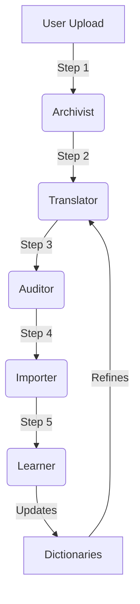

# Self-Improving Ingestion Engine

## Overview

The Self-Improving Ingestion Engine is an autonomous subsystem that leverages the existing 4-agent architecture (Archivist, Translator, Auditor, Oracle) to iterate on data ingestion parsing rules without human intervention. The engine uses an improvement loop to achieve high data coverage and accuracy by updating internal dictionaries.

**Core Principle**: Orchestrate existing agents, don't replace them. Use the Auditor's output as the improvement signal.

---

## Architecture & Simulation Pipeline

The system is visualized through an interactive **Simulation Dashboard** (`/simulation`) which runs the pipeline step-by-step:

### 1. Archivist (Step 1)
- **Role**: Ingests raw Excel/CSV files.
- **Controls**: Users can now specify a **Container Limit** (10, 25, 100, 1000, All) to simulate smaller batches for faster testing.
- **Output**: Raw rows stored in database with "Zero Data Loss" guarantee.

### 2. Translator (Step 2)
- **Role**: AI Schema Detection & Mapping.
- **UI Enhancements**:
    - **Low Confidence Mappings Table**: dedicated table showing any mapping with < 80% confidence, listing specific issues (e.g., "No dictionary match").
    - **Active Mapping Visualization**: clearer `Source -> Target` display with helper text for acronyms (e.g., "etd -> Est. Departure").

### 3. Auditor (Step 3)
- **Role**: Quality Gate & Self-Healing.
- **UI Enhancements**:
    - **Summary Stats Card**: "Total Fields", "Exact Matches", "Discrepancies", and "Quality Score" visible at a glance.
    - **Critical Error Tracking**: Highlights critical data mismatches before they reach the persistent database.

### 4. Importer (Step 4)
- **Role**: Persistence.
- **Function**: Applies the mapping rules and commits data to the `Container` and `Shipment` tables.
- **Features**: Autosaves unmapped fields to `Container.metadata` to ensure no data is discarded even if unmapped.

### 5. Learner (Step 5 - NEW)
- **Role**: Improvement Agent.
- **Function**: Analyzes the "leftover" unmapped metadata from the Importer step.
- **Capabilities**:
    - **Improvement Analyzer**: Uses AI to deduce meanings of unknown headers (e.g., "Vsl Dep" = "atd").
    - **Dictionary Updater**: Autonomously updates `header_synonyms` in `container_ontology.yml` and `business_units.yml`.
- **UI Feedback**:
    - **Future Impact Analysis**: Clearly distinguishes between "Score Improvement" (historical) and "Future Impact" (estimated gain for next import).
    - **Performance Metrics**: Shows processing time and specific dictionary updates applied.

## Training Dashboard (`/training`)

The Training Dashboard is the control center for the **Autonomous Ingestion Engine**. It allows developers to train the system against a suite of diverse test files to ensure the AI learns to handle any file layout before production use.

### Features
*   **Live Monitoring**: Watch the engine think in real-time. See it process files, calculate scores, and learn new synonyms.
*   **Multi-File Batch Testing**: The engine is trained on 5 distinct files simultaneously (`Standard`, `Messy`, `Verbose`, `Minimal`, `Nightmare`) to ensure robust generalization.
*   **Iterative Learning**: The loop continues until the system achieves **>90% Accuracy** across all files.

### Improvement Loop Process
1.  **Baseline Iteration**: The engine processes all 5 files using the *current* dictionary.
    *   *Result*: Often low scores (e.g., 40%) for new layouts.
    *   *Detection*: It identifies "Rows with Errors" (dropped rows) and "Unmapped Headers" (e.g., `CNTR ID`).
2.  **Analysis**: The `Improvement Analyzer` looks at the unmapped headers and uses AI to deduce their meaning (e.g., learning that `CNTR ID` = `container_number`).
3.  **Dictionary Update**: New synonyms are written to `container_ontology.yml`.
4.  **Validation Iteration**: The engine re-runs ALL 5 files with the updated dictionary.
    *   *Success*: Coverage jumps to 100%.
    *   *Regression Check*: If the update caused the score to drop (e.g., broke the Standard file), it **Automatically Reverts** the dictionary to the previous state.
5.  **Completion**: The loop stops when the target score is met or optimization stalls (early stopping).

### Handling "Messy" Data
The engine has specific logic to handle "Messy" files (typos, merged cells, missing headers):
*   **Dropped Row Detection**: If a row fails to import (e.g., missing Container Number), it is flagged as a **Critical Failure**.
*   **Header Scavenging**: The engine strips all headers from that failed row (like `Remaks` or `Dep. Date`) and marks them as candidates for learning.
*   **Result**: Even if the file is initially unreadable, the system learns the "Language" of that vendor within 1-2 iterations.

---

## Components

### 1. Dictionaries
Located in `agents/dictionaries/`:
- `business_units.yml`: Canonical list of Business Units with synonyms and fuzzy variants.
- `container_ontology.yml`: Canonical definition of fields, their header synonyms, and validation rules.

### 2. New Agents
- **Improvement Analyzer** (`agents/improvement-analyzer.ts`): 
  - Input: Aggregated unmapped fields from `AgentProcessingLog` (Auditor stage).
  - Output: JSON suggestions for new synonyms.
  - Role: Acts as a semantic mapper, learning that "Vsl Dep" means "Vessel Departure".

- **Dictionary Updater** (`agents/dictionary-updater.ts`): 
  - Input: Analyzer suggestions.
  - Role: Safe file updater that modifies YAML without valid structure corruption. Manages versioning (e.g., `1.2.0` -> `1.2.1`).

### 3. Background Worker
- **Batch Improvement Worker** (`lib/jobs/batch-improvement-worker.ts`):
  - Orchestrates the full improvement lifecycle without blocking the UI.
  - Handles "Re-Translation" by fetching original raw rows and re-running the agent pipeline.

### 4. API & UI
- **Trigger**: `POST /api/imports/[id]/improve` -> Creates `ImprovementJob`.
- **Poll**: `GET /api/improvement-jobs/[id]` -> Returns status (RUNNING, COMPLETED) and progress %.
- **UI**: `QualityReportModal` provides the user interface for viewing metrics and triggering improvements.
- **Simulation**: `/simulation` offers a transparent, step-by-step view of the entire process with **Log Download** capabilities for debugging.

---

## How to Run

### Via Training Dashboard (Recommended for Developers)
1.  Run `npm run train` (or `npx tsx scripts/train_engine.ts testdata`).
2.  Open `http://localhost:3000/training`.
3.  Watch as the system autonomously iterates, updates dictionaries, and maximizes its score.

### Via Simulation (Developer Mode)
1. Go to `/simulation`.
2. Select a file and a **Row Limit** (e.g., 25 rows).
3. Click **Start Simulation**.
4. Watch the pipeline progress through Archivist, Translator, Auditor, Importer, and Learner.
5. Review the **Low Confidence Table** and **Learner Impact** summary.
6. **Download Logs** if needed for deep dive debugging.

### Via UI (End User)
1. Go to **Import History**.
2. Click the **Quality Badge** on any import.
3. If quality is not 100%, click **"Improve Batch"**.
4. Watch the progress bar as the system autonomously corrects itself.

---

## Data Quality Metrics

The system now calculates real-time quality scores based on the **Auditor** logs:
- **Capture Rate**: % of canonical fields successfully mapped.
- **Confidence**: Average confidence score of AI mappings.
- **Unmapped Fields**: Count of headers that could not be understood.

These metrics drive the "Quality Badges" (Excellent, Good, Needs Improvement, Poor) visible in the dashboard.
    
## Self-Healing & Safety Nets

To ensure high data availability even when AI makes mistakes, the system employs several layers of "Safety Nets":

1.  **Auditor Auto-Patching**: 
    - Before import, the Auditor scans random rows. If it sees a column like `ETD_DATE` is unmapped but matches `etd`, it *patches* the mapping instructions instantly.
    
2.  **Heuristic Fallbacks**:
    - **Business Unit**: If the `Business Unit` column is missing or empty, the Importer automatically derives it from the `Consignee` name (e.g., "HORIZON GLOBAL" -> "Horizon Global").
    - **Service Type**: If the AI misses the `Service Type` column, the Importer scans headers for keywords like `SERV TYPE` or `AWS` to rescue the data.

3.  **Data Completeness Tracking**:
    - Instead of raw field counts, we track the **% of Schema Fields Populated** per container to give a true measure of record quality.
